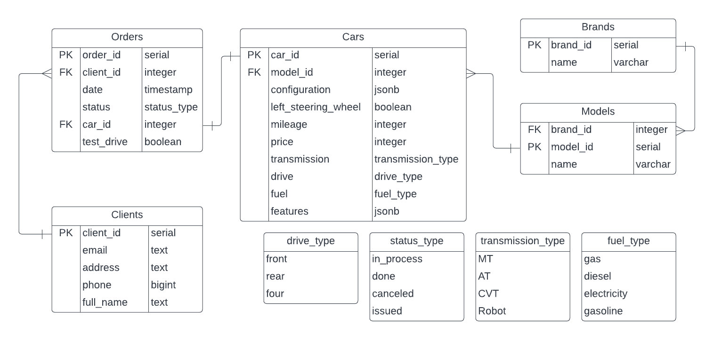

Информационная система автосалона
=======================

Схема базы данных
-----------------

Описание страниц
-----------------------

-----------------------
С любой страницы можно перейти на главную страницу и на страницы с автомобилями, заказами и клиентами, нажав соответвующие кнопки (вверху страницы).

### Главная страница
- Ссылка на список автомобилей продающихся в салоне
- Ссылка на список клиентов салона
- Ссылка на список заказов
- Ссылка на список марок автомобилей, экземпляры которых продаются

### Страница со списком клиентов
- Список всех клиентов автосалона, которые есть в базе данных - ФИО, телефон, электронная почта
- На каждого человека можно нажать, что приведет на его персональную страницу
- Поиск по телефону, электронной почте, ФИО
- Ссылка на страницу для добавления данных о новом клиенте

### Персональная страница клиента
- Возможность редактирования всех данных
- Информация о клиенте - фамилия, имя, отчество, адрес, телефон, адрес электронной почты
- Ссылка на страницу со списком заказов, сделанных этим клиентов (фильтрация списка заказов по клиенту)
- Возможность удалить клиента

### Страница добавления нового клиента
- Форма для заполнения данных о новом клиенте - фамилии, имени, отчества, телефона, адреса, адреса электронной почты

### Страница с марками автомобилей 
- Список марок автомобилей, которые есть в салоне
- Поиск по названия
- Для каждой марки ссылка на страницу со списком моделей данной марки
- Для каждой марки ссылка на страницу со списком автомобилей данной марки (фильтрация списка автомобилей по марке)
- Возможность редактирования названия марки автомобиля и добавления новой марки - указывается новое название марки

### Страница с моделями автомобилей данной марки
- Список моделей автомоболией данной, которые есть в салоне
- Поиск по названию
- Для каждой модели ссылка на страницу со списком автомобилей данной модели (фильтрация списка автомобилей по модели)
- Возможность редактирования названия модели автомобиля и добавления новой модели - указывается новое название модели

### Страница со списком автомобилей
- Список автомобилей, которые продаются автосалоном - марка, модель, год выпуска (если есть в базе), пробег (если есть в базе), цена, тип топлива, коробка передач, тип привода, мощность и объем двигателя (если есть в базе)
- На каждый автомобиль можно нажать, что приведет на его персональную страницу
- Фильтрация автомобилей по характеристикам: основным - цена (диапазон), пробег (диапазон), тип коробки передач, тип топлива, тип привода, расположение руля - выбор из вариантов, марки и модели; и не основным: цвет кузова, количество мест, мощность двигателя, тип кузова и другим возможным
- Ссылка на страницу добавления нового автомобиля

### Страница добавления нового автомобиля
- Форма для заполнения данных о новом автомобиле - марка, модель, цена, пробег, коробка передач, тип топлива, тип привода, расположение руля и возможное добавление других характеристик - тип кузова, цвет кузова, количество мест, количество дверей, вместимость багажника, мощность двигателя, объем двигателя, расход топлива, страна сборки, кондиционер, GPS-навигатор, обивка салона, цвет салона и другие возможные

### Персональная страница автомобиля
- Возможность редактирования всех данных
- Вся информация об автомобиле - марка, модель, цена, пробег, коробка передач, тип топлива, тип привода, расположение руля и возможное добавление других характеристик - тип кузова, цвет кузова, количество мест, количество дверей, вместимость багажника, мощность двигателя, объем двигателя, расход топлива, страна сборки, кондиционер, GPS-навигатор, обивка салона, цвет салона и другие возможные
- Возможность удаления автомобиля
- Ссылка на страницу оформления нового заказа

### Страница оформления нового заказа
- Форма для добавления информации о заказе - дата, нужен ли тест драйв, номер клиента 
- Форма для заполнения данных о клиенте, если номера нет в базе

### Страница со списком заказов
- Список заказов - номер заказа, дата, статус, ФИО и телефон клиента, нужен ли тест драйв, марка и модель машины
- Поиск заказа по номеру заказа
- Фильтрация заказов по дате, статусу, номеру телефона клиента, необходимости тест драйва
- На каждый заказ можно нажать, что приведет на его персональную страницу

### Персональная страница заказа
- Возможность редактирования данных заказа - статуса, нужен ли тест драйв
- Возможность удаления заказа
- Вся информация о заказе - дата, статус, нужен ли тест драйв, основная информация о клиенте (ФИО, телефон), основная информация об автомобиле (марка, модель, цена, пробег)
- Ссылка на страницу заказанного автомобиля
- Ссылка на страницу заказавшего клиента

Сценарии использования
----------------------
Считается, что пользователь начинает с главной страницы
- Добавление клиента
    - Перейти на страницу со списком клиентов
    - Нажать на кнопку "Добавить клиента"
    - Заполнить необходимые поля

- Добавление автомобиля
    - Перейти на страницу со списком автомобилей
    - Нажать на кнопку "Добавить автомобиль"
    - Заполнить необходимые поля,

- Добавление марки автомобиля
    - Перейти на страницу со списком марок автомобилей
    - Нажать на кнопку "Добавить марку"
    - Ввести имя марки

- Добавление модели автомобиля
    - Перейти на страницу со списком марок автомобилей
    - Найти марку добавляемой модели
    - Нажать на кнопку "Модели"
    - Нажать на кнопку "Добавить модель"
    - Ввести имя модели

- Посмотреть заказы клиента
    - Два варианта
1: 
    - Перейти на страницу со списком клиентов
    - Найти клиента по номеру телефона, электронной почте или ФИО
    - Нажать на клиента
    - Нажать на кнопку "Заказы клиента" 
2:
    - Перейти на страницу со списком заказов
    - Отфильтровать по номеру телефона клиента

- Изменить статус заказа
    - Перейти на страницу со списком заказов
    - Найти заказ по номеру или среди других заказов по характеристикам
    - Нажать на заказ
    - Нажать на кнопку "Редактировать"
    - Изменить статус заказа

- Оформить заказ
    - Перейти на страницу со списком автомобиля
    - Отфильтровать список по нужным характеристикам
    - Выбрать автомобиль
    - Нажать на автомобиль
    - Нажать "Оформить покупку"
    - Заполнить необходимые поля

