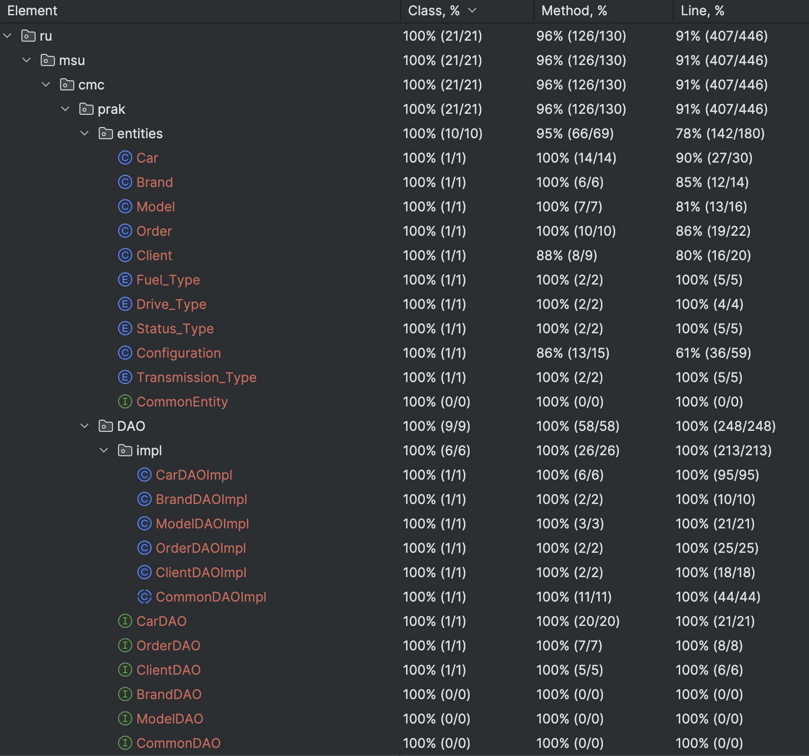

Использована библиотека Lombok для автогенерации геттеров и сеттеров  
Тесты реализованы через JUnit
Связывание объектов с БД происходит с помощью аннотаций hibernate   
  
Покрытие тестами методов и строк DAO 100%  
Покрытие тестами методов хранимых классов 95%, строк - 78%
  
