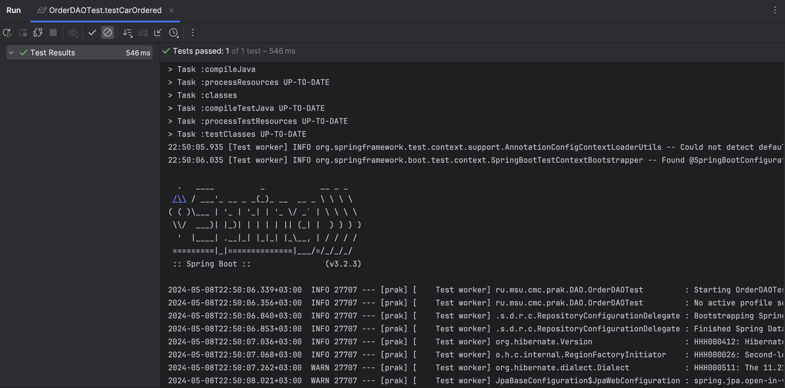
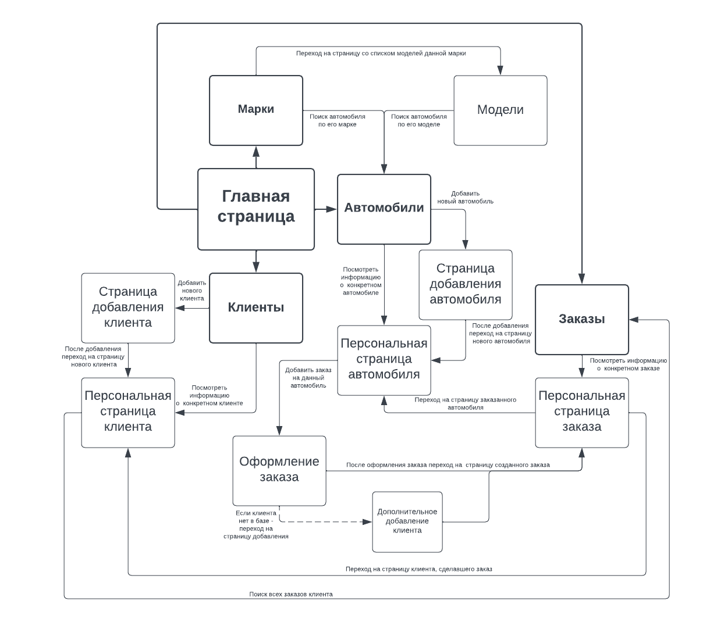
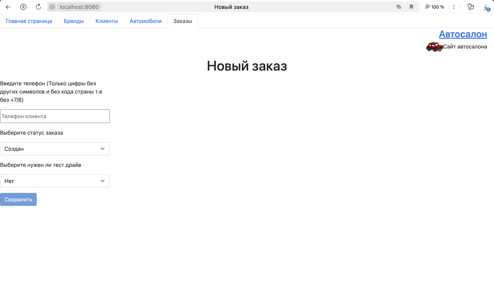

Внесены изменения в классы - OrderDAO, Car, Drive_Type, Fuel_Type, Status_Type, Transmissio_Type  
Добавлены методы для вывода данных в понятном текстовом виде.   
В классе OrderDAO добавлен метод `Order carOrdered(int id)` возвращающий заказ по `id` автомобиля. Также добавлен тест для этого метода в src/test/java/ru/msu/cmc/prak/DAO/OrderDAOTest.java   
  

Веб-страницы созданы при помощи механизма шаблонов Thymeleaf  
Реализованы тесты с использованием Selenium. Тесты на добавление, редактирование, поиск и удаление автомобилей, заказов, клиентов, брендов и моделей.  
Все тесты успешно проходят
  
  
  
  
  
Страницы сайта отвечающие страницам представленным в   
  
  

 
